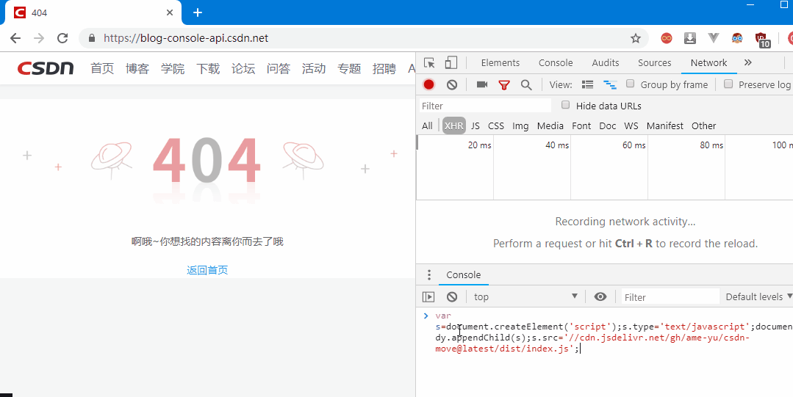

### CSDN-export-script
CSDN博客导出脚本
## ⚠注意
只支持导出老版编辑器（https://editor.csdn.net/md/） 写的文章。

新版编辑器 （https://mp.csdn.net/mp_blog/creation/editor） 并不是标准的markdown导出的会是空文件。[issues](https://github.com/ame-yu/CSDN-export-script/issues/2)

### QuickStart


1. 登陆CSDN，跳转到[https://blog-console-api.csdn.net/](https://blog-console-api.csdn.net/)

2. F12-> console 复制粘贴下面的代码，回车
```js
var s=document.createElement('script');s.type='text/javascript';document.body.appendChild(s);s.src='//cdn.jsdelivr.net/gh/ame-yu/csdn-move@latest/dist/index.js';
```
